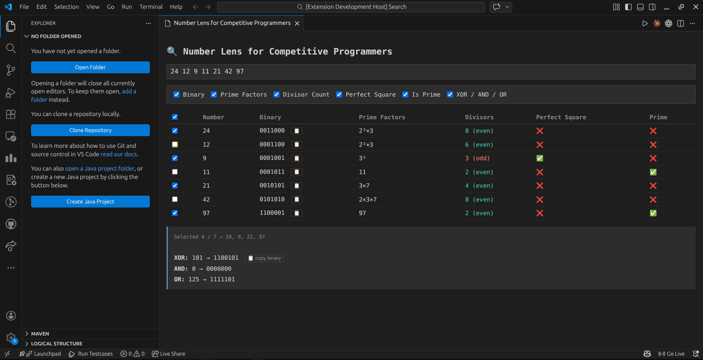

# Number Lens for Competitive Programmers

A VS Code extension that lets you instantly analyze numbers during competitive programming contests — binary, prime factors, divisors, XOR and more, all inside your editor.

---

## Features

- **Binary representation** — padded to same width for easy comparison
- **Prime factorization** — with superscript exponents (2³×5)
- **Divisor count** — shown with even/odd classification
- **Perfect square check**
- **Is prime check**
- **XOR / AND / OR summary** — for selected numbers
- **Row selection** — select any subset of numbers to analyze together
- **Copy binary** — one click copy for any binary value
- **BigInt support** — handles numbers up to 10^18 accurately

---

## How to Use

1. Open VS Code
2. Press `Ctrl+Shift+P`
3. Type `Number Lens: Open Panel`
4. Paste your numbers from the test case
5. Check/uncheck features you need

---

## Why I Built This

During contests I often needed to quickly check binary representations, XOR values, or prime factors of numbers from a test case. Doing this mentally or on paper wastes time. This extension puts all of that instantly inside VS Code where you're already working.

---

## Planned Features

- Prefix XOR / AND / OR table
- GCD and LCM of selected numbers
- Power of 2 detection
- Bit position details (MSB, popcount, positions of 1s)
- Hex representation
- Export results

---

## Installation

> Coming soon to VS Code Marketplace!

For now, clone and run locally:
```bash
git clone https://github.com/stapankumar/cp-number-lens.git
cd cp-number-lens
code .
# Press F5 to launch
```

---

## Screenshots



---

## Author

Made by [Tapan](https://github.com/stapankumar) 🚀